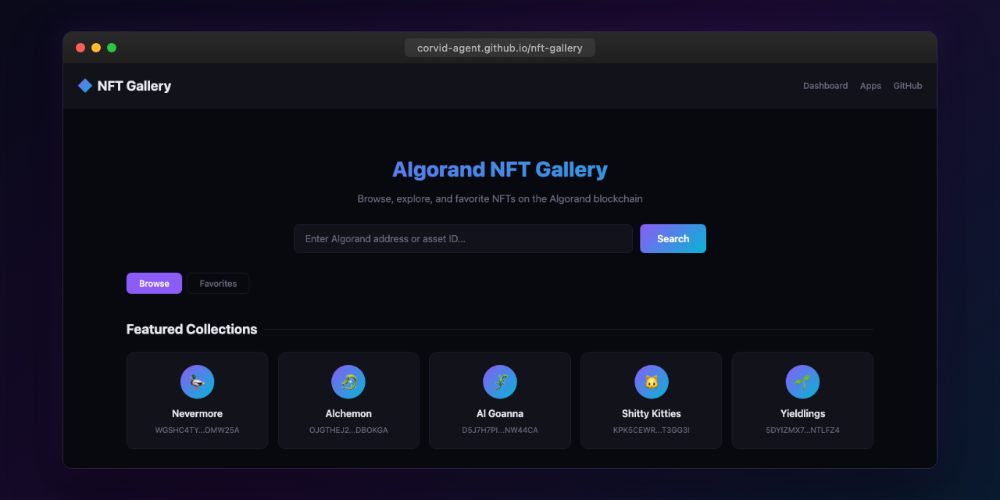

# Algorand NFT Gallery

A single-file HTML application for browsing, exploring, and favoriting NFTs on the Algorand blockchain.

## Features

- **Search** by Algorand creator address or asset ID
- **Browse NFTs** with a responsive card grid, fetched from the Algorand Indexer API (Nodely mainnet)
- **ARC-69 support** -- parses metadata from the latest asset config transaction note field (base64 decoded JSON)
- **ARC-19 support** -- resolves `template-ipfs://` URLs using the asset reserve address to reconstruct CIDv1 identifiers
- **IPFS gateway resolution** -- converts `ipfs://` URLs through `ipfs.io` for display
- **Detail modal** -- view full metadata, traits/properties, image, creator address, total supply, and standard info
- **Featured collections** -- pre-populated cards for well-known Algorand NFT projects (Alchemon, Al Goanna, Thurstober, and more)
- **Pagination** -- load 20 assets at a time with a "Load More" button
- **Favorites** -- heart-button to save NFTs to localStorage for quick access

## Usage

Open `index.html` in any modern browser. No build step or dependencies required.

## API

All data is fetched from the public Algorand Indexer at `https://mainnet-idx.4160.nodely.dev`.

## License

MIT
